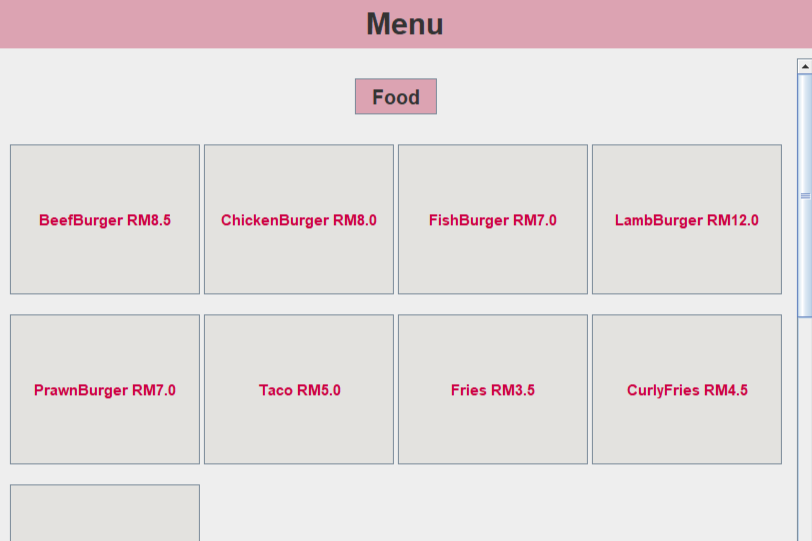
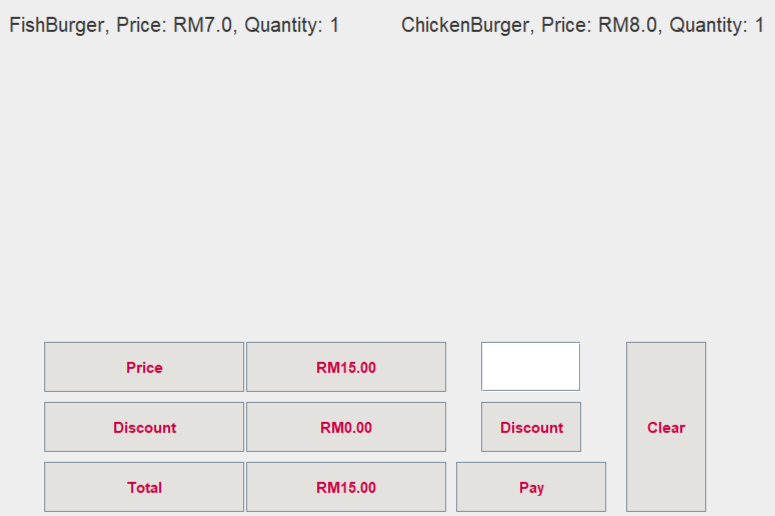

# Restaurant Menu System

A simulation system developed using Java for an assignment. This project was created by me to learn Java.

## Features

Three main feature of the system:

### Browse through the menu

Users can view the menu which consists of foods and beverages.

### Add an item

Pick an item and put it in the cart. The cart automatically sums up the items added.

### View Profile

Check the profile to view details, balance and membership points.

## Development Installation

### Prerequisites

1. Install Java SDK, for example [Oracle](https://www.oracle.com/java/technologies/downloads/).
2. Install an IDE. For example [Visual Studio Code](https://code.visualstudio.com/).

### Open project

Open project using File > Open folder.

